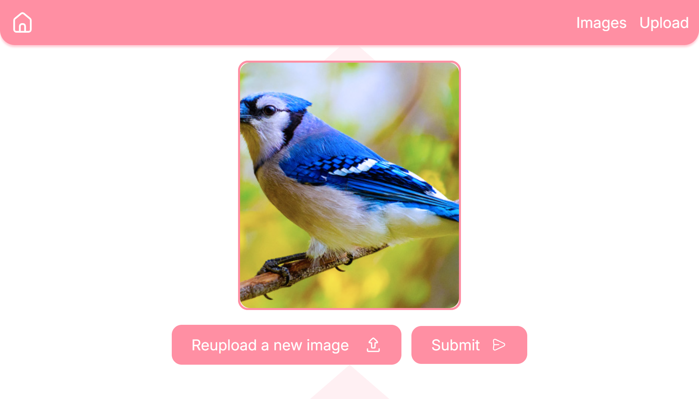
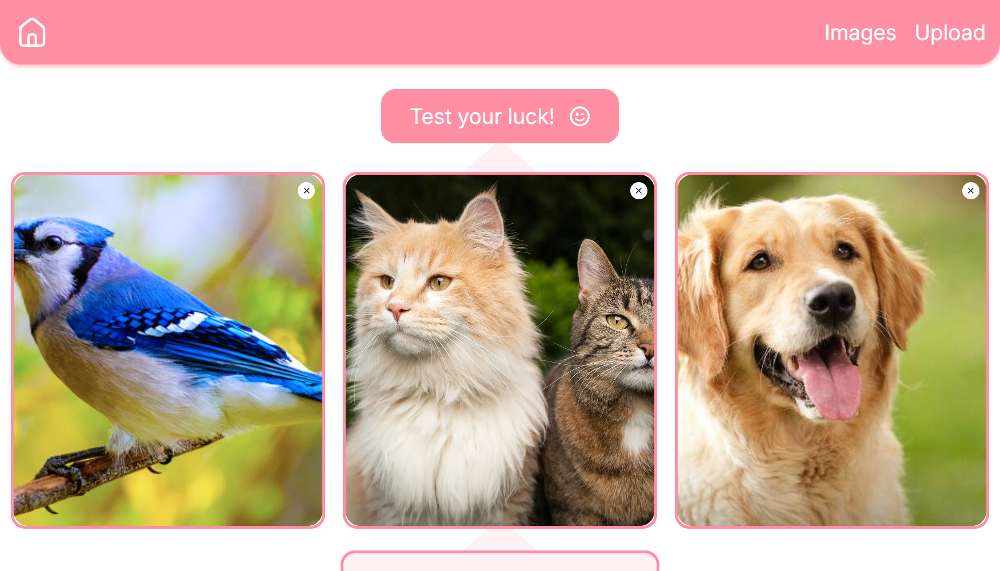
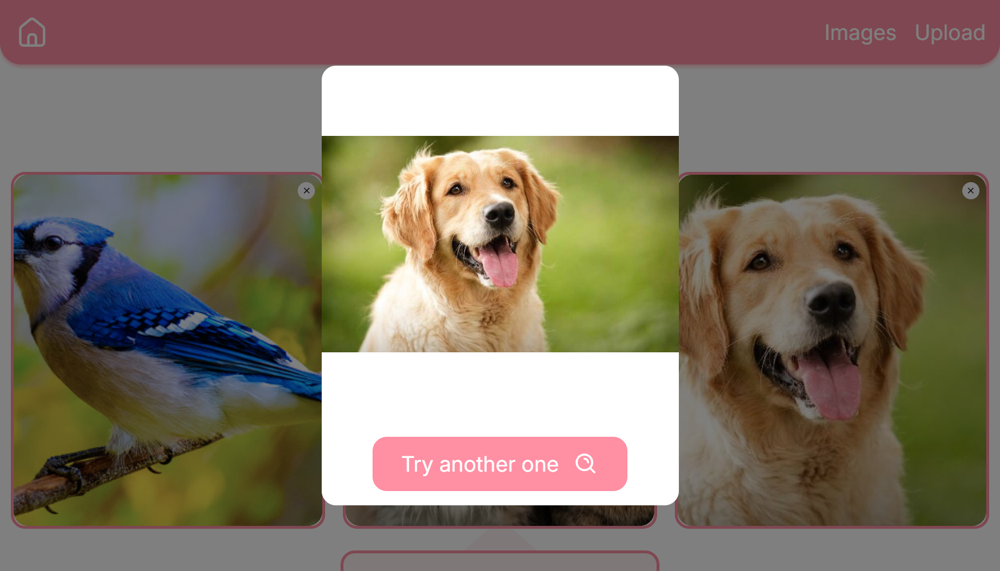

# Pick Stuff website

Upload your images and pick a random one

## Screenshots from the project


<hr>

<hr>


## How to run the project

1. Clone this project by using the ```git clone https://github.com/DayVee-Programming/Pick-Stuff-frontend.git``` command on your terminal or you can download it by pressing on 'Code' button --> 'Download ZIP'
2. Open the cloned project folder with your editor and execute the `npm i` and `npm run dev` commands on your terminal
3. Open it on your local server

## Find a bug?

If you found an issue or would like to suggest an improvement, please feel free to submit an issue using the issues tab above or submit a pull request with a fix. Additionally, you can contact me through my website - https://dayvee-programming.netlify.app/contact